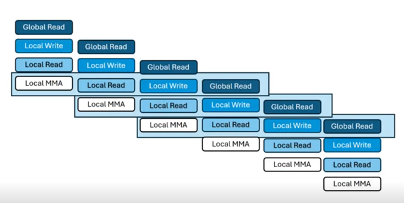

Four Stage Pipelined Scheduler
==============================

Overview
--------

The **FourStageScheduler** implements a software-pipelined execution pattern
for GPU kernels that use global memory loads, shared memory staging, and
MMA compute operations.

The scheduler reorders these operations into a **four-stage pipeline** with an
initiation interval (II) of 1. This allows overlapping of memory operations and
compute to improve throughput.

Pipeline Stages
---------------

Each operation in the kernel is classified into one of the following stages:

.. list-table::
   :header-rows: 1

   * - Stage
     - Description
   * - ``GLOBAL_LOAD``
     - Load data from global memory into registers.
   * - ``LOCAL_STORE``
     - Write register data into shared (LDS) memory.
   * - ``LOCAL_LOAD``
     - Load data from shared memory into registers for computation.
   * - ``COMPUTE``
     - Execute MMA, VALU, SHUFFLE, or other compute-bound operations.
   * - ``SCHEDULING_NOOP``
     - Placeholder for operations that do not participate in scheduling.

Valid stage transitions are enforced to preserve pipeline order:

- ``GLOBAL_LOAD`` → ``LOCAL_STORE``
- ``LOCAL_STORE`` → ``LOCAL_LOAD``
- ``GLOBAL_LOAD`` → ``LOCAL_LOAD`` (combined global-to-shared)
- ``LOCAL_LOAD`` → ``COMPUTE``
- ``COMPUTE`` → ``GLOBAL_LOAD``

Scheduling Transformation
-------------------------

The scheduler transforms a naïve loop structure:

.. code-block:: text

    for i = 0 to N:
        a = READ_GLOBAL i
        WRITE_SHARED a
        barrier
        b = READ_SHARED
        COMPUTE b

into a **four-stage pipelined loop** with double-buffered shared memory when
multibuffering is turned on and set to 2:

.. code-block:: text

    a_0 = READ_GLOBAL 0
    WRITE_SHARED a_0 SM[0]
    a_1 = READ_GLOBAL 1

    b_0 = READ_SHARED SM[0]
    WRITE_SHARED a_1 SM[1]
    a_2 = READ_GLOBAL 2

    for i = 0 to N - 3:
        COMPUTE b_i
        b_{i+1} = READ_SHARED SM[(i+1) % 2]
        WRITE_SHARED a_{i+2} SM[i % 2]
        a_{i+3} = READ_GLOBAL i+3
        barrier

    COMPUTE b_{n-2}
    b_{n-1} = READ_SHARED SM[(n-1) % 2]
    WRITE_SHARED a_n SM[n % 2]

    COMPUTE b_{n-1}
    b_n = READ_SHARED SM[n % 2]

    COMPUTE b_n

Preconditions
-------------

- Only a single MMA instruction group is present in the kernel.
- Graph edges correctly represent data dependencies between operations.

Benefits
--------

- Overlaps memory loads with compute.
- Reduces idle cycles between stages.
- Uses double-buffered shared memory to hide memory latency.

Execution Timeline
------------------

The following diagram shows how the four stages are overlapped
when the initiation interval (II) is 1 for a gemm kernel. Each
row represents a pipeline stage; each column is a cycle; `a_i`
are global loads, `w_i` are shared-memory stores, `l_i` are
shared-memory loads, and `c_i` are compute steps.

::

    Cycle →       0    1     2     3     4     5     6
                  |    |     |     |     |     |     |
    GLOBAL_LOAD: a0   a1    a2    a3    a4    a5    a6
    LOCAL_STORE:      w0    w1    w2    w3    w4    w5
    LOCAL_LOAD:             l0    l1    l2    l3    l4
    COMPUTE:                      c0    c1    c2    c3

Legend:
    a_i  = READ_GLOBAL for iteration i
    w_i  = WRITE_SHARED for iteration i
    l_i  = READ_SHARED for iteration i
    c_i  = COMPUTE for iteration i

Here, the pipeline is fully filled starting at cycle 3,
after which every cycle launches the next iteration's work.
This hides memory latency by overlapping global loads, shared
stores/loads, and compute in a steady-state rhythm.

Below is a picture with cycles flowing top to bottom:

