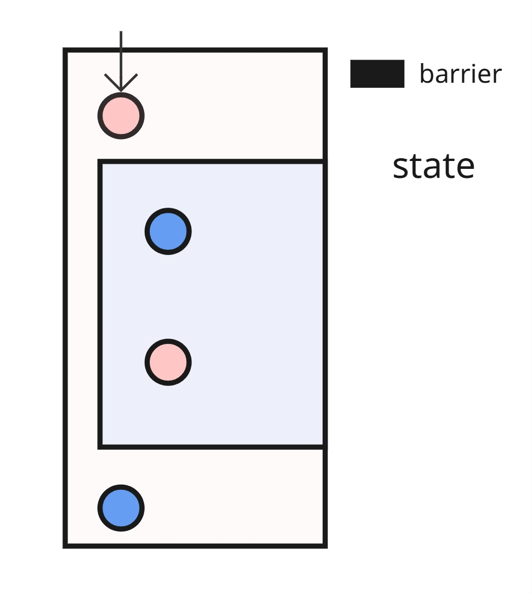
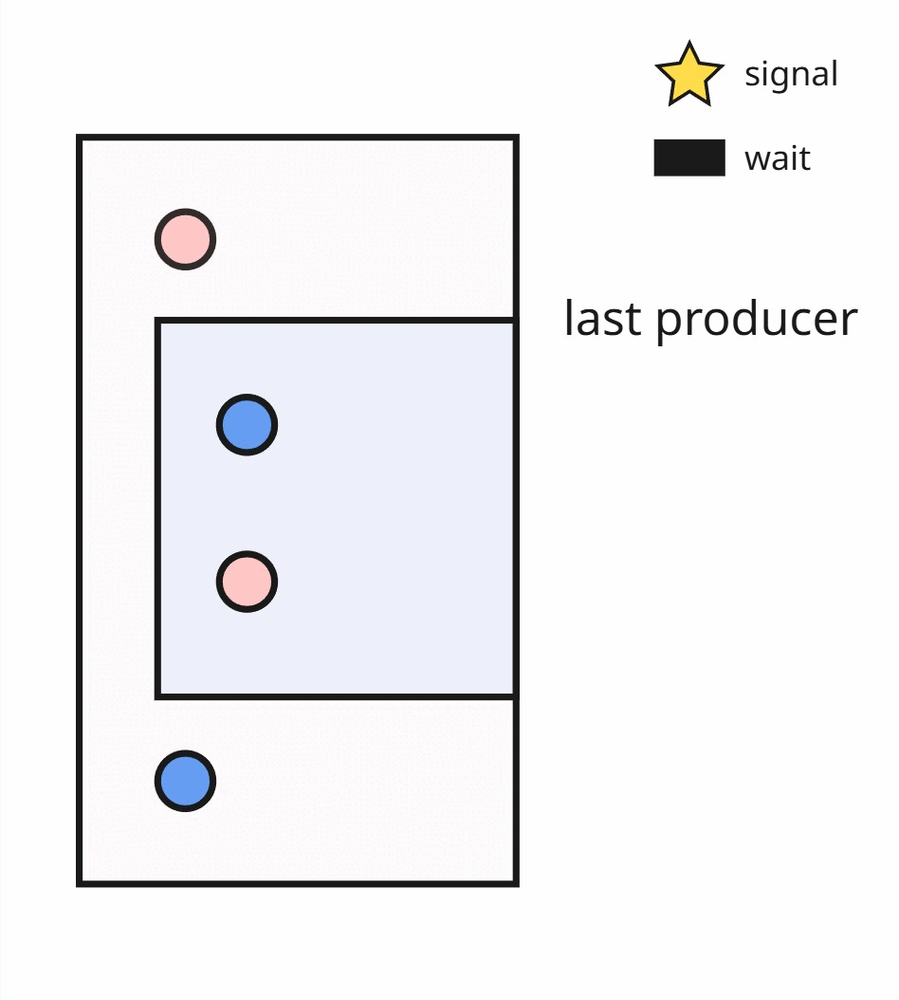

Shared Memory Barrier Placements
================================

We want to automatically insert shared-memory barriers so that read/write/atomics on the same LDS (shared memory) region are ordered correctly.
To be more specific, cases like RAW (read after write), WAR (write after read), or touch memory via atomics, we must synchronize to avoid races and hangs. On gfx94, gfx95, we support basic shared memory barriers via `amdgpu.lds_barrier`; on gfx120x we prefer split barriers (Signal / Wait), split barriers are supported via lowering to `rocdl.s.wait_dscnt`, `rocdl.s.barrier.signal`, and `rocdl.s.barrier.wait`.

Glossary
--------------------
- Shared Memory Access Types
    * Read (READ)
    * Write (WRITE)
    * Atomic (READ_WRITE)
    * GatherToLDS (WRITE)
    * TensorLoadToLDS (WRITE)

- Nested region op types
    * Iterate
    * Conditional

- Split barriers: two-part synchronization using signal (after producer) and wait (before consumer), supported on gfx12 targets.

- RAW / WAR hazards: classic shared memory hazards (Write→Read and Read→Write), this is represented as a closed interval in the pass (SyncRegion).

**Note.** We will use producer to refer to an access type operator that takes ownership of a shared memory region for a period of time; consumer to refer to an access type operator that operates on the same shared memory region and therefore needs to synchronize before the producer releases it.

When do we need a barrier?
--------------------------
- Basic shared memory barrier
    * If access types of producer and consumer are different. -> insert a barrier in front of the consumer node.

- GFX12 split barrier
    * If access types of producer and consumer are different. -> insert a signal after the producer and a wait before the consumer.

- READ_WRITE is involved {acts like both a producer and a consumer}
    * If it has a producer then this node will be treated like a consumer.
    * If it has a consumer then this node will be treated like a producer.
    * Either case, barriers are expected to be inserted with the logic described above.

Visualization: add_shared_memory_barriers
-----------------------------------------
- Basic barrier

The above gif is a visual illustration for inserting shared memory barriers between producers and consumers.

- Split barrier

The above gif is a visual illustration for inserting split barriers between producers and consumers.

Key Ideas:
----------
- A hazard is a producer–consumer relationship on shared memory that needs ordering.
- We model hazards as intervals/window/regions.
- minimize_placement_strategy is aimed at monolithic barriers (e.g., amdgpu.lds_barrier) and greedily places the fewest barriers before consumers by sorting on right endpoints.
- find_disjoint_interval_strategy is designed for split barriers: it reuses the minimize_placement_strategy and coalesces hazard windows into the smallest feasible intersection, emits signal/wait pairs at the intersection bounary.

Public API:
-----------
.. code-block:: python

   add_shared_memory_barriers(trace: CapturedTrace, target: str = "") -> None

- Input: a captured FX trace and an optional target string.
- Effect: analyzes the trace, generates synchronization requirements, and emits barriers appropriate for the target.

Implementation:
---------------
Target
------
  TargetConfig describes what barriers to emit (monothlitic or split).

Analysis
--------
Core idea
- Track, per shared resource, a rolling “window” of producers (writers) followed by consumers (readers).
- When a new producer starts, the previous window (if it had both sides) is finalized into a barrier requirement.

``add_sync_requirements``
  - Takes the last producer and the first consumer in the current window.
  - Skips if their access types don’t actually require a barrier.
  - Marks as loop carried if producer’s topo index is greater than consumer’s.
  - Emits a ``SyncRegion`` with resource, enclosing nodes, enclosing intervals, loop bounds.

``add_hazard_if_window_valid``
  - Finalizes the current window only if it contains at least one producer and one consumer.
  - Calls ``add_sync_requirements``, then resets the window.

``handle_hazard``
  - For a single node: determine access kind and the shared resource (with depth for next iter).
  - Attach optional ``graph_info`` (loop body [start, end]) to the window for later annotation.
  - If node is a producer kind: flush current window, then record this producer.
  - If node is a consumer kind and producers exist: record this consumer.

``get_hazard_handle``
  Returns a partially applied ``handle_hazard`` with chosen producer/consumer kinds (e.g., RAW or WAR).

``get_barriers_analysis``
  - Assigns topo indices via pre-order walk.
  - Recursively walks the root graph and nested regions:
    - For Iterate: walk body twice (depth 0 for same iter, depth 1 for next iter) carrying [start, end].
    - For Conditional: walk its subgraph once.

- Runs two passes: WAR, then RAW; each pass maintains its own per-resource windows and flushes after traversal.

Placement strategies
--------------------
We'll use `window` to refer to a SyncRegion hazard interval, the interval is defined by the topological positions between a producer and a consumer.

Two strategies are currently available; both take a list of SyncRegion and return a reduced set of barrier placement positions.
    - ``Minimize placement (minimize_placement_strategy)``:
        - Intent: Use the fewest possible barriers, placed before consumers.
        - Procedure:
            1. Sort all SyncRegions by their endpoints. (earliest barrier requirements)
            2. Forward Hazard Sweep
                - For normal intervals (start < end), we maintain a single "last chosen position", initialize as -1 (an impossible topology position)
                - For each interval, if no existing barrier lies in (start, end], this mean the hazard window is not covered, a barrier is needed in that position, add one to list, and update `last_pos`.
            3. Cross-iteration (loop) hazards
                - For loop-carried intervals (start > end), each forms a circular interval on [graph_start, graph_end].
                - Check if an existing barrier lies in segments: (start, end] or (graph_start, end]
                - If neither segment contains a barrier, this position requires a barrier, add one to list

    - ``Disjoint interval (find_disjoint_interval_strategy)``:
        - Intent: When using split barriers (signal/wait), you want pairs that:
            - Cover hazards (respect RAW/WAR windows),
            - Minimize waits (so fewer consumers are serialized),
            - Place signals as early as safely possible (to maximize overlap/concurrency), and
            - Avoid tangled pairs (disjoint intervals are easier for downstream passes and analyzers).
        note that minimize_placement_strategy already gives us the best possible wait positions (fewest consumers to wait at). So the remaining question is: where do we put the matching signals? That’s exactly what find_disjoint_interval_strategy answers—by choosing, for each selected wait, the nearest earlier producer that still forms a valid window.

        - TL;DR
            1.	First, compute a minimal set of wait sites using minimize_placement_strategy (i.e., pick the fewest consumer positions that “stab” all hazard windows).
            2.	Then, for each chosen wait, pick the closest feasible signal (a producer that occurs before that wait) so that each (signal, wait) pair covers at least one hazard window and does not overlap other pairs more than necessary.
            3.	Finally, fall back to “signal immediately before wait” in two edge cases:
                - when there’s no earlier producer (purely cross-iteration graphs), or
                - when the candidate signal lives in a different subgraph than the consumer.
        This creates disjoint signal–wait intervals wherever possible, making split barriers easier to schedule and verify while preserving the minimality of waits.

        - Inputs and outputs
            - Input: a list of SyncRegion items (each with producer, consumer, prod_location, cons_location, and cross_iter flags). Think of each item as a hazard window (prod_location, cons_location].
            - Output: a new list of (signal, wait) pairs (as SyncRegions) where:
            - Waits are a minimal set returned by minimize_placement_strategy.
            - Signals are chosen to be as early as feasible while remaining valid.
Emission
--------------------
Constructing BarrierEmitter(...) returns an instance of the subclass based on TargetConfig:
- LegacyBarrierEmitter (amdgpu.lds_barrier): emits monolithic SharedMemoryBarrier before the consumer.
- BasicSplitBarrierEmitter (rocdl.s.barrier.signal/rocdl.s.barrier.wait {barId: -1}) emits a signal after a producer and a wait before a consumer.
    - Verification: Scanning the pre-order traversal of the full nested graph.
        - no wait appears before its corresponding signal,
        - only a single barrier ID is used (-1),
        - no orphaned signals remain.

End-to-End flow
--------------------
- Build TargetConfig from target string.
- Walk the graph in the pre-order manner and assign _topo_location.
- Run get_barriers_analysis function to get a list of SyncRegions.
- BarrierEmitter dispatch to choose Legacy or BasicSplit emitter.
- Optimize placements, then emit barriers.
- Run verify on the resulting graph to avoid GPU hangs.

Known Limitations / TODO
--------------------
- We are now propagating memory access of an op in the nested-region with `depth` set to 1
