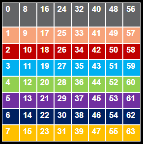
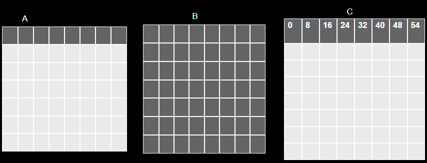
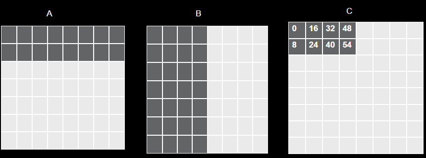

==============================
Workgroup Reordering in Wave
==============================

This document describes the workgroup reordering feature enabled in the Wave. Workgroup reordering has been shown to improve L2 cache hit rates for GEMM kernels,
and given how central GEMM operations are in machine learning, this mechanism offers kernel authors the opportunity to boost performance.

Overview
========

When executing a kernel, a grid of workgroups is launched. Each workgroup maps to a portion of the data being processed and executes instructions on that segment — this is known as *indexing*.
Workgroups contain *waves*, and waves contain *threads*. Each of these SIMD layers uses different indexing calculations, so workgroup reordering will focus specifically on workgroup indexing without affecting internal wave/thread indexing.

It's important to note that the dimensions of the data are distinct to the dimensions of the workgroup grid. A standard GEMM kernel computing `A × Bᵀ` uses these dimensions:

- Matrix A has shape `(M × K)`
- Matrix B has shape `(N × K)`
- The result matrix C has shape `(M × N)`

The workgroup grid has two dimensions: dimension 0 and dimension 1. Each workgroup `w` can be represented by coordinates `(wg0, wg1)`, where:

- `wg0` is the index along the 0th grid dimension
- `wg1` is the index along the 1st grid dimension

Workgroup-to-Data Mapping
=========================

Wave's `WorkgroupConstraint` is the feature linking the workgroup grid to the data matrices. For example, this code:

.. code-block:: python

    tkw.WorkgroupConstraint(M, BLOCK_M, 0)
    tkw.WorkgroupConstraint(N, BLOCK_N, 1)

distributes the M dimension of the data across the 0th workgroup grid dimension, and N across the 1st. Each workgroup thus handles `BLOCK_M` rows and `BLOCK_N` columns.

Flattened Workgroup Layout
==========================

Although conceptually visualized as a 2D grid, workgroups are stored linearly or "flattened" in hardware. The 0th dimension (`wg0`) is the "faster" dimension, meaning:

- workgroup `(0, 0)` → linear index 0 / flat workgroup id 0
- workgroup `(1, 0)` → linear index 1 / flat workgroup id 1
- workgroup `(2, 0)` → linear index 2 / flat workgroup id 2
- etc.

In other words, flattened workgroup ids follow the launch grid in column-major order.
Going back to our MXN C matrix, if the number of workgroups along both the 0th and 1st dimension of the launch grid are 8, the launch grid and its workgroup ids would map to the data as so:

.. image:: ./default_wg_ordering.png
   :alt: Flattened workgroup mapping
   :align: center

Hardware Architecture and Cache Implications
============================================

On AMD GPUs, a *Compute Unit* (CU) handles a single workgroup. The MI300X GPU has:

- 40 CUs (38 active) per *XCD* (Accelerator Complex Die)
- 4 MB of shared L2 cache among the CUs within each XCD

The XCD of the CU which a workgroup is assigned to is determined in round-robin fashion. That is:

- Workgroup 0 → first CU in XCD 0
- Workgroup 1 → first CU in XCD 1
- Workgroup 2 → first CU in XCD 2
- ...
- Workgroup 7 → first CU in XCD 7
- Workgroup 8 → second CU in XCD 0
- Workgroup 9 → second CU in XCD 1
- and so on...

The following diagram illustrates how workgroups from the 8x8 launch grid above are distributed across the 8 XCDs:

Each color represents a different XCD. For example, workgroups 0, 8, 16, 24, 32, 40, 48, and 56 all map to XCD 0 (gray).

This mapping means spatial locality within an XCD matters. If neighboring data is processed by CUs within the same XCD, L2 cache hit rates improve, which motivates the use of workgroup reordering.

Default vs. Reordered Launch Grids
==================================

Let's focus on the workgroups assigned to XCD 0 when computing an 8×8 output matrix:

In the default column-major launch order, computing 8 output blocks of matrix `C` requires reading:

- 8 blocks from matrix `A` (rows)
- 64 blocks from matrix `B` (columns)
- **72 total input blocks**

Now consider a reordered launch pattern:

In this scheme, we assign workgroups in *grouped rows*. We use a grouping factor of 2 in the example above, so:

- Assign 2 workgroups to 2 consecutive rows (along `M`) in the first column.
- Then move to the next column along `N` and assign the next two workgroups across the same two rows.
- After the 2 rows are completely assigned to workgroups, move to the next 2 consecutive rows and repeat.

In this case, computing 8 output blocks of matrix `C` now requires reading:

- 16 blocks from matrix `A` (rows)
- 32 blocks from matrix `B` (columns)
- **48 total input blocks**
Thus, this reordering reduces the amount of new reads and promotes cache reuse.

Reordering Logic: Code Example
==============================

We can implement this reordering scheme as follows:

.. code-block:: python

    wg0, wg1 = WORKGROUP_0, WORKGROUP_1
    num_wg_0 = ceiling(M / BLOCK_M)
    num_wg_1 = ceiling(N / BLOCK_N)
    num_wgs_total = num_wg_0 * num_wg_1
    num_xcds = 8

    # Flatten 2D workgroup indices (column-major)
    flat_wg_index = wg1 * num_wg_0 + wg0

    # Compute logical index for XCD-based reordering
    extra_wgs = num_wgs_total % num_xcds
    xcd_wg_index = (
        (flat_wg_index % num_xcds) * (num_wgs_total // num_xcds)
        + Min(flat_wg_index % num_xcds, extra_wgs)
        + (flat_wg_index // num_xcds)
    )

    # Determine grouping along M dimension
    num_wg_group = GROUP_SIZE_M * num_wg_1
    group_id = xcd_wg_index // num_wg_group
    first_wg_id_0 = group_id * GROUP_SIZE_M
    group_size_m = Min(num_wg_0 - first_wg_id_0, GROUP_SIZE_M)

    # Compute new coordinates
    new_wg0 = first_wg_id_0 + ((xcd_wg_index % num_wg_group) % group_size_m)
    new_wg1 = (xcd_wg_index % num_wg_group) // group_size_m

    # Add reordering constraints
    constraints += [tkw.ReorderingConstraint(new_wg0, 0)]
    constraints += [tkw.ReorderingConstraint(new_wg1, 1)]

Explanation
===========

Here's a breakdown of what this code does:

1. **`wg0`, `wg1`**: Retrieve the symbolic expressions for the original 2D workgroup indices.
2. **Flattening**: Convert 2D coordinates (wg0, wg1) into 1D index `flat_wg_index`
3. **XCD-aware indexing**: Convert `flat_wg_index` into `xcd_wg_index` that indexes each workgroup with respect to its XCD. In our 8x8 case,
   XCD 0 contains `xcd_wg_index` 0 to 7, XCD 1 contains `xcd_wg_index` 8 to 15, and so on.
4. **Grouping**: Groups are defined across `GROUP_SIZE_M` rows of workgroups.
5. **Reordered coordinates**: `new_wg0` and `new_wg1` reflect the spatially-local launch order.

The parameter `GROUP_SIZE_M` controls how many consecutive workgroup rows are grouped together before moving horizontally across columns on `N`.

Finally, `tkw.ReorderingConstraint` updates the kernel's launch grid to reflect the new order.

Results
=======

This section compares kernel performance with and without workgroup reordering across various matrix shapes by measuring TFLOPs.

Test configuration:

1. `BLOCK_M = 128`
2. `BLOCK_N = 256`
3. `BLOCK_K = 64`
4. `GROUP_SIZE_M = 8`
5. `tkw.WaveConstraint(M, BLOCK_M // 4)` and `tkw.WaveConstraint(N, BLOCK_N // 2)`
   (enables Ping Pong)
6. `mfma_variant = MMAType.F32_16x16x16_F16`
7. `enable_scheduling = SchedulingType.PREFETCH`

Kernel TFLOPs
---------------------------

+-------------------------+----------------+------------------+
| Shape (M, N, K)         | Normal Wave    | Reordered Wave   |
+=========================+================+==================+
| 2048 × 2048 × 2048      | 275            | 300              |
+-------------------------+----------------+------------------+
| 4096 × 4096 × 4096      | 620            | 656              |
+-------------------------+----------------+------------------+
| 4864 × 4096 × 4160      | 904            | 921              |
+-------------------------+----------------+------------------+
| 4864 × 8192 × 4160      | 880            | 894              |
+-------------------------+----------------+------------------+
| 16384 × 4096 × 8192     | 610            | 679              |
+-------------------------+----------------+------------------+

Conclusion
==========

By using `ReorderingConstraint`, kernel authors can control how workgroups are mapped to data along the dimensions of the workgroup grid and explore different reordering schemes to provide potential performance boosts.
